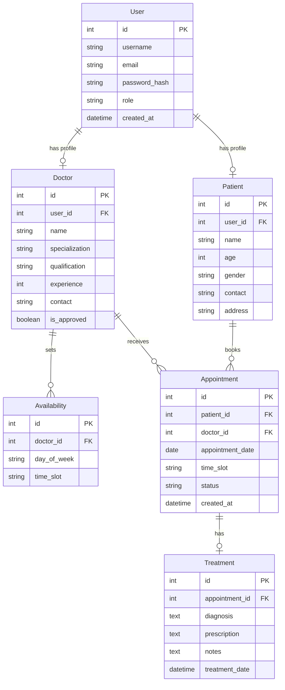

# 🏥 Hospital Management System (HMS)

> A comprehensive web-based Hospital Management System built with Flask for the MAD-1 Project (IIT Madras)

[](https://flask.palletsprojects.com/)
[](https://www.python.org/)
[](https://www.sqlite.org/)
[](https://getbootstrap.com/)

---

## 📋 Table of Contents

- [Overview](#-overview)
- [Features](#-features)
- [Database Schema](#-database-schema)
- [Tech Stack](#-tech-stack)
- [Installation](#-installation)
- [Usage](#-usage)
- [Project Structure](#-project-structure)
- [Screenshots](#-screenshots)
- [API Endpoints](#-api-endpoints)

---

## 🎯 Overview

The Hospital Management System is a full-stack web application designed to streamline hospital operations by managing three key user roles: **Administrators**, **Doctors**, and **Patients**. The system facilitates appointment scheduling, doctor availability management, patient records, and treatment tracking.

### Key Highlights

✅ **Role-Based Access Control** - Separate dashboards for Admin, Doctor, and Patient  
✅ **Appointment Management** - Book, confirm, cancel, and track appointments  
✅ **Doctor Availability** - Flexible time slot management for doctors  
✅ **Treatment Records** - Comprehensive diagnosis and prescription tracking  
✅ **Search & Filter** - Advanced search for doctors by name and specialization  
✅ **Responsive Design** - Mobile-friendly interface with Bootstrap 5  

---

## ✨ Features

### 👨‍💼 Admin Features
- **Doctor Management**
  - Approve/reject new doctor registrations
  - View all registered doctors with details
  - Remove doctors from the system
- **Appointment Oversight**
  - View all appointments across the hospital
  - Monitor appointment statistics and trends
- **Advanced Search**
  - Search doctors by name or specialization
  - Filter and sort results

### 👨‍⚕️ Doctor Features
- **Availability Management**
  - Set weekly availability with multiple time slots
  - Flexible scheduling (Morning, Afternoon, Evening slots)
  - Update availability anytime
- **Appointment Management**
  - View all patient appointments
  - Confirm or cancel appointments
  - Access patient contact information
- **Treatment Records**
  - Add diagnosis and prescriptions
  - Maintain comprehensive treatment history
  - View past treatments for patients

### 👤 Patient Features
- **Doctor Discovery**
  - Browse all approved doctors
  - View doctor specializations, qualifications, and experience
  - Check doctor availability
- **Appointment Booking**
  - Book appointments with preferred doctors
  - Select from available time slots
  - View appointment status (Pending/Confirmed/Completed/Cancelled)
- **Medical History**
  - View appointment history
  - Access treatment records and prescriptions
  - Track all past diagnoses

---

## 🗄️ Database Schema

### Entity-Relationship Diagram



### Database Models

| Model | Description | Key Relationships |
|-------|-------------|-------------------|
| **User** | Base authentication model | One-to-One with Doctor/Patient |
| **Doctor** | Doctor profile and credentials | One-to-Many with Appointments, Availability |
| **Patient** | Patient demographics | One-to-Many with Appointments |
| **Availability** | Doctor's weekly schedule | Many-to-One with Doctor |
| **Appointment** | Booking records | Many-to-One with Doctor & Patient |
| **Treatment** | Medical records | One-to-One with Appointment |

---

## 🛠️ Tech Stack

### Backend
- **Framework:** Flask 3.0.0
- **ORM:** SQLAlchemy (Flask-SQLAlchemy)
- **Database:** SQLite
- **Authentication:** Werkzeug Security (password hashing)
- **Session Management:** Flask Sessions

### Frontend
- **UI Framework:** Bootstrap 5.3
- **Template Engine:** Jinja2
- **CSS:** Custom styling with modern design
- **Icons:** Bootstrap Icons

### Development Tools
- **Python:** 3.8+
- **Package Manager:** pip
- **Version Control:** Git

---

## 🚀 Installation

### Prerequisites
- Python 3.8 or higher
- pip (Python package manager)
- Git (optional, for cloning)

### Step-by-Step Setup

1. **Clone the repository** (or download ZIP)
   ```bash
   git clone https://github.com/YOUR_USERNAME/HMS_23f2004645.git
   cd HMS_23f2004645
   ```

2. **Create a virtual environment** (recommended)
   ```bash
   python -m venv venv
   
   # On Windows
   venv\Scripts\activate
   
   # On macOS/Linux
   source venv/bin/activate
   ```

3. **Install dependencies**
   ```bash
   pip install -r requirements.txt
   ```

4. **Initialize the database**
   ```bash
   python init_db.py
   ```
   This creates the SQLite database and populates it with sample data.

5. **Run the application**
   ```bash
   python app.py
   ```

6. **Access the application**
   Open your browser and navigate to:
   ```
   http://127.0.0.1:5000
   ```

---

## 🔐 Usage

### Default Login Credentials

| Role | Email | Password |
|------|-------|----------|
| **Admin** | admin@hospital.com | admin123 |
| **Doctor** | dr.sharma@hospital.com | doctor123 |
| **Patient** | patient1@email.com | patient123 |

### Quick Start Guide

1. **As Admin:**
   - Login with admin credentials
   - Navigate to "Manage Doctors" to approve pending doctors
   - View all appointments in "All Appointments"
   - Use search to find specific doctors

2. **As Doctor:**
   - Login with doctor credentials
   - Set your availability in "My Availability"
   - View and manage appointments in "My Appointments"
   - Add treatment records for completed appointments

3. **As Patient:**
   - Login with patient credentials
   - Browse available doctors in "Browse Doctors"
   - Book an appointment by selecting a doctor and time slot
   - View your appointment history and treatment records

---

## 📁 Project Structure

```
HMS_23f2004645/
├── app.py                  # Main Flask application
├── models.py               # SQLAlchemy database models
├── config.py               # Configuration settings
├── init_db.py              # Database initialization script
├── requirements.txt        # Python dependencies
├── README.md               # Project documentation
├── Project_Report.pdf      # Detailed project report
│
├── instance/
│   └── hospital.db         # SQLite database (created after init)
│
├── static/
│   └── style.css           # Custom CSS styles
│
└── templates/              # Jinja2 HTML templates
    ├── base.html           # Base template with navbar
    ├── index.html          # Landing page
    ├── login.html          # Login page
    ├── register.html       # Registration page
    │
    ├── admin_dashboard.html        # Admin dashboard
    ├── manage_doctors.html         # Doctor approval interface
    ├── all_appointments.html       # All appointments view
    ├── search_doctors.html         # Doctor search interface
    │
    ├── doctor_dashboard.html       # Doctor dashboard
    ├── doctor_availability.html    # Availability management
    ├── doctor_appointments.html    # Doctor's appointments
    ├── add_treatment.html          # Treatment form
    │
    ├── patient_dashboard.html      # Patient dashboard
    ├── browse_doctors.html         # Doctor listing
    ├── book_appointment.html       # Appointment booking
    └── patient_appointments.html   # Patient's appointments
```

---

## 📸 Screenshots

> **Note:** Add screenshots of your application here to showcase the UI

### Landing Page
*Homepage with role selection and login*

### Admin Dashboard
*Doctor management and appointment oversight*

### Doctor Dashboard
*Availability settings and appointment management*

### Patient Dashboard
*Doctor browsing and appointment booking*

---

## 🔌 API Endpoints

### Authentication
- `GET /` - Landing page
- `GET /login` - Login page
- `POST /login` - Process login
- `GET /register` - Registration page
- `POST /register` - Process registration
- `GET /logout` - Logout user

### Admin Routes
- `GET /admin/dashboard` - Admin dashboard
- `GET /admin/manage_doctors` - Doctor management
- `POST /admin/approve_doctor/<id>` - Approve doctor
- `POST /admin/remove_doctor/<id>` - Remove doctor
- `GET /admin/all_appointments` - View all appointments
- `GET /admin/search_doctors` - Search doctors

### Doctor Routes
- `GET /doctor/dashboard` - Doctor dashboard
- `GET /doctor/availability` - View/edit availability
- `POST /doctor/availability` - Update availability
- `GET /doctor/appointments` - View appointments
- `POST /doctor/confirm_appointment/<id>` - Confirm appointment
- `POST /doctor/cancel_appointment/<id>` - Cancel appointment
- `GET /doctor/add_treatment/<id>` - Treatment form
- `POST /doctor/add_treatment/<id>` - Save treatment

### Patient Routes
- `GET /patient/dashboard` - Patient dashboard
- `GET /patient/browse_doctors` - Browse doctors
- `GET /patient/book_appointment/<doctor_id>` - Booking form
- `POST /patient/book_appointment/<doctor_id>` - Create appointment
- `GET /patient/appointments` - View appointments
- `POST /patient/cancel_appointment/<id>` - Cancel appointment

---

## 👨‍💻 Author

**Student ID:** 23f2004645  
**Course:** MAD-1 (Modern Application Development - 1)  
**Institution:** IIT Madras

---

## 📄 License

This project is created for academic purposes as part of the MAD-1 course at IIT Madras.

---

## 🙏 Acknowledgments

- IIT Madras for the course structure and guidance
- Flask documentation and community
- Bootstrap team for the UI framework

---

## 📞 Support

For any queries or issues, please refer to the Project Report PDF included in this repository.

---

**Made with ❤️ for MAD-1 Project | IIT Madras**
