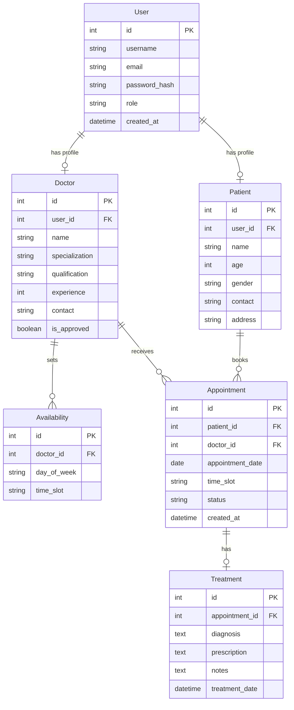

# Hospital Management System

A comprehensive web-based Hospital Management System built with Flask.

[](https://flask.palletsprojects.com/)
[](https://www.python.org/)
[](https://www.sqlite.org/)
[](https://getbootstrap.com/)

---

## Overview

The Hospital Management System is a full-stack web application designed to streamline hospital operations by managing three key user roles: **Administrators**, **Doctors**, and **Patients**. The system facilitates appointment scheduling, doctor availability management, patient records, and treatment tracking.

### Key Highlights

- **Role-Based Access Control** — Separate dashboards for Admin, Doctor, and Patient
- **Appointment Management** — Book, confirm, cancel, and track appointments
- **Doctor Availability** — Flexible time slot management for doctors
- **Treatment Records** — Comprehensive diagnosis and prescription tracking
- **Search & Filter** — Advanced search for doctors by name and specialization
- **Responsive Design** — Mobile-friendly interface with Bootstrap 5

---

## Features

### Admin Features
- **Doctor Management** — Approve/reject new doctor registrations, view all registered doctors, remove doctors
- **Appointment Oversight** — View all appointments across the hospital, monitor statistics and trends
- **Advanced Search** — Search doctors by name or specialization, filter and sort results

### Doctor Features
- **Availability Management** — Set weekly availability with multiple time slots, flexible scheduling
- **Appointment Management** — View all patient appointments, confirm or cancel, access patient contact information
- **Treatment Records** — Add diagnosis and prescriptions, maintain comprehensive treatment history

### Patient Features
- **Doctor Discovery** — Browse all approved doctors, view specializations, qualifications, and experience
- **Appointment Booking** — Book appointments with preferred doctors, select from available time slots
- **Medical History** — View appointment history, access treatment records and prescriptions

---

## Database Schema

### Entity-Relationship Diagram



---

## Tech Stack

### Backend
- **Framework:** Flask 3.0.0
- **ORM:** SQLAlchemy (Flask-SQLAlchemy)
- **Database:** SQLite
- **Authentication:** Werkzeug Security (password hashing)

### Frontend
- **UI Framework:** Bootstrap 5.3
- **Template Engine:** Jinja2
- **CSS:** Custom styling with modern design

---

## Installation

### Prerequisites
- Python 3.8 or higher
- pip (Python package manager)

### Step-by-Step Setup

1. **Clone the repository**
   ```bash
   git clone https://github.com/zetroretron/hospital-management-system.git
   cd hospital-management-system
   ```

2. **Create a virtual environment** (recommended)
   ```bash
   python -m venv venv
   
   # On Windows
   venv\Scripts\activate
   
   # On macOS/Linux
   source venv/bin/activate
   ```

3. **Install dependencies**
   ```bash
   pip install -r requirements.txt
   ```

4. **Initialize the database**
   ```bash
   python init_db.py
   ```

5. **Run the application**
   ```bash
   python app.py
   ```

6. **Access the application**
   ```
   http://127.0.0.1:5000
   ```

---

## Usage

### Default Login Credentials

| Role | Email | Password |
|------|-------|----------|
| **Admin** | admin@hospital.com | admin123 |
| **Doctor** | dr.sharma@hospital.com | doctor123 |
| **Patient** | patient1@email.com | patient123 |

### Quick Start Guide

1. **As Admin:** Login, navigate to "Manage Doctors" to approve pending doctors, view all appointments.
2. **As Doctor:** Login, set availability in "My Availability", view and manage appointments, add treatment records.
3. **As Patient:** Login, browse doctors, book appointments, view appointment history and treatment records.

---

## Project Structure

```
hospital-management-system/
├── app.py                  # Main Flask application
├── models.py               # SQLAlchemy database models
├── config.py               # Configuration settings
├── init_db.py              # Database initialization script
├── requirements.txt        # Python dependencies
├── README.md               # Project documentation
│
├── instance/
│   └── hospital.db         # SQLite database (created after init)
│
├── static/
│   └── style.css           # Custom CSS styles
│
└── templates/              # Jinja2 HTML templates
    ├── base.html           # Base template with navbar
    ├── index.html          # Landing page
    ├── login.html          # Login page
    ├── register.html       # Registration page
    ├── admin_dashboard.html        # Admin dashboard
    ├── manage_doctors.html         # Doctor approval interface
    ├── all_appointments.html       # All appointments view
    ├── search_doctors.html         # Doctor search interface
    ├── doctor_dashboard.html       # Doctor dashboard
    ├── doctor_availability.html    # Availability management
    ├── doctor_appointments.html    # Doctor's appointments
    ├── add_treatment.html          # Treatment form
    ├── patient_dashboard.html      # Patient dashboard
    ├── browse_doctors.html         # Doctor listing
    ├── book_appointment.html       # Appointment booking
    └── patient_appointments.html   # Patient's appointments
```

---

## API Endpoints

### Authentication
- `GET /` — Landing page
- `GET /login` / `POST /login` — Login
- `GET /register` / `POST /register` — Registration
- `GET /logout` — Logout

### Admin Routes
- `GET /admin/dashboard` — Admin dashboard
- `GET /admin/manage_doctors` — Doctor management
- `POST /admin/approve_doctor/<id>` — Approve doctor
- `POST /admin/remove_doctor/<id>` — Remove doctor
- `GET /admin/all_appointments` — View all appointments
- `GET /admin/search_doctors` — Search doctors

### Doctor Routes
- `GET /doctor/dashboard` — Doctor dashboard
- `GET /doctor/availability` / `POST /doctor/availability` — Availability management
- `GET /doctor/appointments` — View appointments
- `POST /doctor/confirm_appointment/<id>` — Confirm appointment
- `POST /doctor/cancel_appointment/<id>` — Cancel appointment
- `GET /doctor/add_treatment/<id>` / `POST /doctor/add_treatment/<id>` — Treatment records

### Patient Routes
- `GET /patient/dashboard` — Patient dashboard
- `GET /patient/browse_doctors` — Browse doctors
- `GET /patient/book_appointment/<doctor_id>` / `POST /patient/book_appointment/<doctor_id>` — Booking
- `GET /patient/appointments` — View appointments
- `POST /patient/cancel_appointment/<id>` — Cancel appointment

---

## License

MIT License
